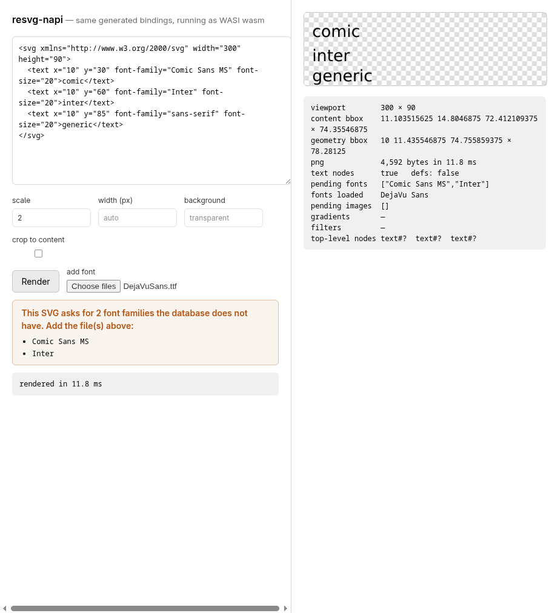

# resvg-napi

Node.js bindings for [resvg](https://github.com/linebender/resvg) 0.48, generated
from the upstream Rust sources.

```js
import { Resvg, FontDatabase, renderAsync } from 'resvg-napi'

const doc = new Resvg(svg, { dpi: 192, fontFamily: 'DejaVu Sans' })
doc.renderPng({ width: 1200, background: '#fff' })      // Buffer
doc.renderRaw({ crop: doc.absLayerBoundingBox() })      // RGBA8, trimmed
await renderAsync(svg, options, { width: 1200 })        // off the event loop
```

## How this package is built

`build.rs` parses the sources of `usvg`, `resvg`, `fontdb`, `tiny-skia-path` and
`strict-num` with `syn`, and emits `src/lib.rs` with `quote`. Everything that
describes upstream — types, names, signatures, doc comments, even bounds such as
the precision clamp read out of usvg's `POW_VEC` — is derived. The hand-written
part is the API shape: what a `Pixmap` becomes, how images and fonts are
resolved, what runs on a worker thread.

`src/lib.rs`, `index.js` and `index.d.ts` are generated *and* committed, and the
generator is deterministic: CI regenerates them and fails on any diff.

To build against a checkout instead of the crates.io cache:

```bash
USVG_SRC_DIR=/path/to/resvg/crates/usvg/src cargo build --release
```

## Platforms

| | x64 | arm64 |
|---|---|---|
| Linux (glibc) | ✅ | ✅ |
| Linux (musl) | ✅ | ✅ |
| macOS | ✅ | ✅ |
| Windows (MSVC) | ✅ | ✅ |
| WASI (`wasm32-wasip1-threads`) | ✅ | — |

The dependency tree is pure Rust — `fontconfig` support comes from
`fontconfig-parser`, not the C library — so every target cross-compiles without
a system SDK.

The WASI build is the same generated bindings on emnapi instead of node-api, and
it is complete: rendering, `toString`, bounding boxes, the node walk, `renderAsync`
(threads via `wasm32-wasip1-threads`) and even filesystem image resolution all
work. One difference: `loadSystemFonts()` finds 0 faces inside the sandbox, so
fonts must be supplied with `loadFontData(buffer)`.

Adding a target is one line in `package.json` under `napi.targets`, plus a row in
the CI matrix; then `npm run create-npm-dirs`.

## Fitting text to a width

An Illustrator template says how wide a field may be on the element itself
(`data-maxwidth="85"`), which is not SVG — resvg drops it. `fit.mjs` reads the
constraint from the source, measures the rendered text with
`node(id).extent()`, and compresses the element horizontally, composing a
`scale(k 1)` onto whatever transform it already has (the same device those
templates use by hand):

```js
import { fitTextWidths } from 'resvg-napi/fit.mjs'

const { svg, adjustments, problems } = fitTextWidths(source,
  (s) => new Resvg(s, { fontFamily }, fonts))
// adjustments: [{ id: 'surname', from: 200.23, to: 90, factor: 0.4495, measured: 90.0031 }]
```

A geometric scale is exactly linear in width, so one pass lands on the target;
the second measurement is a check, and it is reported. Text that already fits is
left untouched, and a constraint that cannot be honoured says why: no `id` to
measure by, no visible extent, or an unusable width. It compresses glyphs rather
than reducing `font-size` — the choice the templates already made.

## Diagnostics

usvg and resvg report every recoverable problem through the `log` crate —
unparsable values, skipped shapes, unmatched font families, images that could not
be read. Nothing consumes that by default, so those messages used to vanish:

```js
import { setLogLevel, takeLogs, Resvg } from 'resvg-napi'

setLogLevel('warn')            // off | error | warn | info | debug | trace
new Resvg(svg).renderPng()
takeLogs()
// [ "WARN usvg::parser::style: Failed to parse fill value: 'notacolour'. Fallback to black.",
//   "WARN usvg::parser::shapes: Rect '' has an invalid 'width' value. Skipped." ]
```

`takeLogs()` drains the buffer, which is capped at 500 entries so a pathological
document cannot grow it without end.

## Browser demo

```bash
npm run demo      # builds the wasm, bundles the loaders, serves on :8787
```



The page is laid out as a prepress proof: a slug line of job metadata, crop
corners, and the render framed by registration marks with tick rules measuring
its real extent. `absLayerBoundingBox()` can be drawn over it in registration
magenta. Everything both engines said — Liquid errors, unknown filters, and every
`log` message from usvg — accumulates in a diagnostics list, with a count in the
slug line so a problem is visible without scrolling.

The page parses the SVG first and **asks for what the document is missing**, then
lets you supply it:

- **fonts** — `pendingFonts()` gives the named families the database does not
  have; a text element with no font loaded gets its own prompt (a generic
  `font-family` never appears as a named family).
- **images** — `pendingImages()` gives the hrefs neither the uploads nor the
  filesystem resolved, one file field per href, because the file/href pairing has
  to be explicit.
- **a variable used as an image href** gets a *file* field, a drop target and a
  text field (for a `data:` URI or a file name) instead of a plain text one:
  the page scans the `href` of every `<image>` tag for `{{ … }}` and, once a file
  is picked, substitutes a synthetic `var:<name>` href and registers the bytes
  under it — so resolution never depends on what the placeholder renders to.

Tags work as they do anywhere in Liquid, `` and `` included. A
collection a loop iterates over is labelled `iterated` and takes **JSON**: a value
starting with `[` or `{` is parsed, so `staff` can be
`[{"name":"Ada","dept":{"code":"OS"}}]` and the loop renders a row per entry. Bad
JSON is reported rather than silently used as a string. Loop locals (`row.*`) get
no field of their own — correctly, they come from the collection.

Liquid does not auto-escape and this output lands inside XML, so a value holding
`&`, `<` or `>` breaks the document. Escaping the scope would corrupt what a
filter receives (`qr` legitimately returns markup), so the page reports the exact
path instead: `` `staff[0].name` contains <, > or & … pipe it through `escape` ``.

Every upload has three routes, because a file picker is not always usable — a
browser driven by automation swallows the dialog, for one: drop on the zone or on
the row itself, paste (⌘/Ctrl-V), or the per-item field.  a font goes to
the database, an image is matched to a pending href by file name when it matches
and to the first one still waiting otherwise. Uploads are kept in a page-level
map and handed to every parse, so they survive edits and re-renders — unlike
`resolveImage`, which only patches one instance.

### Liquid templates

The page runs the SVG through [LiquidJS](https://liquidjs.com) first, so a
templated document can be previewed:

- `liquid.globalVariableSegmentsSync()` lists the variables the template expects,
  as segments, and the page builds one field per **full path**:
  `{{ user.givenName }}` is its own field, not a field called `user`. Values are
  written back into a nested scope (`{ user: { givenName } }`), including array
  indices (`a[0].b`). A dynamic key (`{{ x[y.z] }}`) has no fixed field, so it is
  skipped.
- A field left empty renders back to its own `{{ name }}`, which is why an image
  variable stays visible to `pendingImages()` and can still be uploaded.
- A variable that is piped through filters shows the whole chain on its own row
  (`user.dept.name | upcase`) — the static analysis only reports the
  variable name, so the chains are read off the output tags.
- `strictFilters` is off, so an unknown filter passes its value through instead of
  throwing.
- `{{ upn | qr: '#ffffff', '#00000000' }}` generates a real QR code, as SVG:
  `qrSvg()` in `demo/liquid-entry.mjs` encodes with `qrcode-generator` and emits
  one `<path>` for the dark modules inside a nested `<svg viewBox="0 0 n n"
  width="100%" height="100%">`, so it scales to whatever viewport the template
  drops it into without knowing the module count. Arguments are the module
  colour, the background (`#00000000` for transparent — usvg accepts 8-digit hex)
  and the error-correction level.

The variable names come from LiquidJS's static analysis
(`globalVariablesSync`). The filter chains do not: that API reports variables
only, so they are read off the parsed template — an `Output` node carries
`value.initial` and `value.filters` (name plus args), which beats splitting the
source on `|`. Which variables are image hrefs is an XML question, so that one
goes through `DOMParser`, with a scan as fallback while the source is mid-edit.

Typing in a variable field records the value immediately but defers the work:
re-parsing is debounced to 200 ms, re-rendering to 350 ms, and the fields are
only rebuilt when the *set* of variables changes — rebuilding them on every
keystroke destroys the focused input mid-word.

Two input guards, both learned the hard way: a leading newline before
`<?xml … ?>` makes usvg reject the document (Illustrator exports have one), and
an XML declaration pasted into a variable field would land mid-file. Both are
stripped in `source()`.

### Browser specifics

Three things the demo has to handle, all visible in
`demo/index.html`:

- **COOP + COEP headers.** The wasm is built for `wasm32-wasip1-threads`, so it
  wants a shared memory, so it needs `SharedArrayBuffer`, so the page must be
  cross-origin isolated. `demo/serve.mjs` sets both headers.
- **A `Buffer` polyfill.** napi's `Buffer` return type is Node's Buffer and
  emnapi looks it up on `globalThis`. A 6-line `Uint8Array` subclass is enough —
  but its `from` must accept a `SharedArrayBuffer`, or every buffer comes back
  empty.
- **Copy out of shared memory.** `Blob`, `fetch` bodies and `postMessage` all
  refuse views backed by a `SharedArrayBuffer`; `new Uint8Array(buf)` copies.

## Scripts

```
npm run build        # napi build --platform --release
npm test             # 9 test files, native + typings
npm run typecheck    # tsc --strict over index.d.ts and demo.mts
```

## Licence

Apache-2.0 OR MIT, matching resvg.
