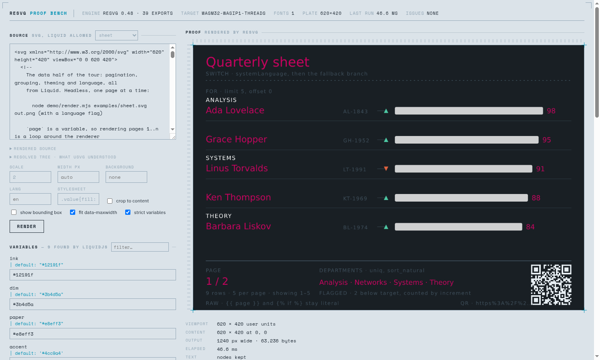
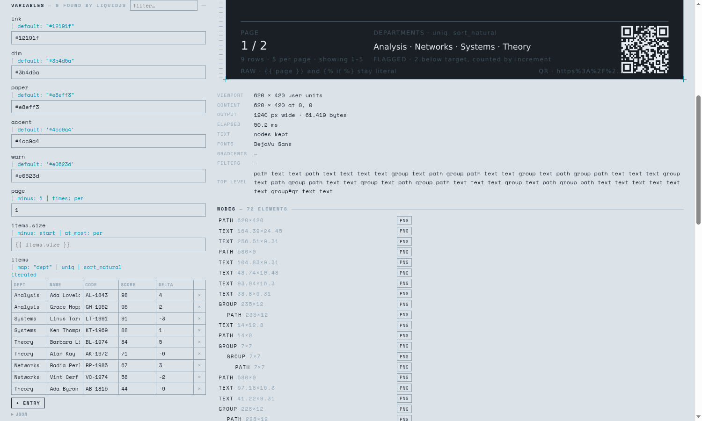

<!-- Moved out of the root README: this documents the demo, not the library. -->

# Browser demo

```bash
npm run demo      # builds the wasm, bundles the loaders, serves on :8787
```



The page is laid out as a prepress proof: a slug line of job metadata, crop
corners, and the render framed by registration marks with tick rules measuring
its real extent. `absLayerBoundingBox()` can be drawn over it in registration
magenta. Everything both engines said — Liquid errors, unknown filters, and every
`log` message from usvg — accumulates in a diagnostics list, with a count in the
slug line so a problem is visible without scrolling.

The page parses the SVG first and **asks for what the document is missing**, then
lets you supply it:

- **fonts** — `pendingFonts()` gives the named families the database does not
  have; a text element with no font loaded gets its own prompt (a generic
  `font-family` never appears as a named family). Each named family gets a
  **fetch** button, and there is a box for one by name at any time — see
  *Fonts without a file* below.
- **images** — `pendingImages()` gives the hrefs neither the uploads nor the
  filesystem resolved, one file field per href, because the file/href pairing has
  to be explicit.
- **a variable used as an image href** gets a *file* field, a drop target and a
  text field (for a `data:` URI or a file name) instead of a plain text one:
  the page scans the `href` of every `<image>` tag for `{{ … }}` and, once a file
  is picked, substitutes a synthetic `var:<name>` href and registers the bytes
  under it — so resolution never depends on what the placeholder renders to.

A collection gets a **table**, not a JSON box: the columns come from the loop
body itself. `` plus the locals it reads (`row.name`,
`row.dept.code`, `row.lead`) are enough to know the shape of one entry, so the
editor has a column per field, a control per type — checkbox for a boolean,
number field for a number — and add/remove per row. The value underneath stays a
JSON array, and the raw JSON is one disclosure away.



`examples/roster.svg` is a worked example: a table whose rows come from an
array of objects. Its data lives in `roster.json` next to it, which the example
picker loads for you.

Tags work as they do anywhere in Liquid, `` and `` included. A
collection a loop iterates over is labelled `iterated` and takes **JSON**: a value
starting with `[` or `{` is parsed, so `staff` can be
`[{"name":"Ada","dept":{"code":"OS"}}]` and the loop renders a row per entry. Bad
JSON is reported rather than silently used as a string. Loop locals (`row.*`) get
no field of their own — correctly, they come from the collection.

Liquid does not auto-escape and this output lands inside XML, so a value holding
`&`, `<` or `>` breaks the document. Escaping the scope would corrupt what a
filter receives (`qr` legitimately returns markup), so the page reports the exact
path instead: `` `staff[0].name` contains <, > or & … pipe it through `escape` ``.

Every upload has three routes, because a file picker is not always usable — a
browser driven by automation swallows the dialog, for one: drop on the zone or on
the row itself, paste (⌘/Ctrl-V), or the per-item field.  a font goes to
the database, an image is matched to a pending href by file name when it matches
and to the first one still waiting otherwise. Uploads are kept in a page-level
map and handed to every parse, so they survive edits and re-renders — unlike
`resolveImage`, which only patches one instance.

## Fonts without a file

WASI has no system fonts, so `loadSystemFonts()` finds nothing and every glyph
has to come from a file. Dropping one is not the only way: type a name in the
**fetch a font** box, or press the **fetch** button on a family the document is
missing.

| you type | it gets |
|---|---|
| `Lobster`, `Playfair Display`, `JetBrains Mono` | that family from google/fonts |
| `fontawesome` (or `fa`) | Font Awesome Free — solid, brands, regular |
| `https://…/anything.ttf` | that file |

The reason it does not go through the Google Fonts CSS API: that API negotiates
on `User-Agent` and serves a browser **WOFF2**, which `ttf-parser` — under
fontdb, under usvg — does not read. A browser cannot lie about its UA in
`fetch`. The original TTFs live in the [google/fonts](https://github.com/google/fonts)
repository instead, and jsDelivr serves them with
`access-control-allow-origin: *`, which is what gets them past the COEP that the
wasm threads force on this page. Fontsource publishes only WOFF2, so it is no
use here either.

One GitHub API call per family, because the file name is not derivable:
`Lobster-Regular.ttf`, but `Roboto[wdth,wght].ttf` with the variable axes spelled
into the name. The directory listing is the only thing that knows. That call is
capped at 60 an hour per address — a miss costs three, one per licence
directory — so it happens once per family and never per render. Upright is
preferred over italic, then the shortest name, which lands on the variable font
when there is one: it covers every weight the document may ask for.

Font Awesome registers as `Font Awesome 6 Free` and `Font Awesome 6 Brands` (and
answers to the version 5 names). Its glyphs sit in the private use area, so write
them by codepoint:

```svg
<text font-family="Font Awesome 6 Free" font-size="30">&#xf005;</text>
```

## Liquid templates

The page runs the SVG through [LiquidJS](https://liquidjs.com) first, so a
templated document can be previewed:

- `liquid.globalVariableSegmentsSync()` lists the variables the template expects,
  as segments, and the page builds one field per **full path**:
  `{{ user.givenName }}` is its own field, not a field called `user`. Values are
  written back into a nested scope (`{ user: { givenName } }`), including array
  indices (`a[0].b`). A dynamic key (`{{ x[y.z] }}`) has no fixed field, so it is
  skipped.
- A field left empty renders back to its own `{{ name }}`, which is why an image
  variable stays visible to `pendingImages()` and can still be uploaded. The
  exception is a chain containing `default:` — that field starts empty so the
  template's own default is what you see.
- A variable that is piped through filters shows the whole chain on its own row
  (`user.dept.name | upcase`) — the static analysis only reports the
  variable name, so the chains are read off the output tags.
- `strictFilters` is off, so an unknown filter passes its value through instead of
  throwing. `strictVariables` is **on**: anything the analysis missed raises
  `undefined variable` instead of rendering as empty. LiquidJS has no
  in-template escape from it — not even `default` — so a field a loop reads must
  exist on every entry. The page fills the gaps it can see (the columns the loop
  body reads) with an empty value and says which entries it filled, because
  `` reports the failure at line 1 of the partial, where it means
  nothing.
- `` and `` work: the partial names the template asks
  for are read off the parsed tags (`node.file`), listed under **Not resolved**
  until you drop them, and served to LiquidJS from a `Map` through a small
  in-memory `fs`. A `.liquid` file is always a fragment; a `.svg` is one only
  when the template renders it by that name, otherwise it is an image.
- Four filters exist because a renderer is in the room, and all four ask resvg
  how wide a string is (`node('m').extent()`):
  `fit: width, size` cuts a string to an ellipsis that fits, by bisection;
  `wrap: width, size[, lineHeight]` breaks text into `<tspan>` lines, which SVG
  1.1 will not do for you (place the block with a `transform` — a tspan's `x` is
  absolute); `sparkline: w, h` turns an array of numbers into a `points`
  attribute; `measure: size` returns the width itself. They live in
  `svg-filters.mjs`, next to the `memoryFs` and the partial scanner.
- `{{ upn | qr: '#ffffff', '#00000000' }}` generates a real QR code, as SVG:
  `qrSvg()` in `liquid-entry.mjs` encodes with `qrcode-generator` and emits
  one `<path>` for the dark modules inside a nested `<svg viewBox="0 0 n n"
  width="100%" height="100%">`, so it scales to whatever viewport the template
  drops it into without knowing the module count. Arguments are the module
  colour, the background (`#00000000` for transparent — usvg accepts 8-digit hex)
  and the error-correction level.

The variable names come from LiquidJS's static analysis
(`globalVariablesSync`). The filter chains do not: that API reports variables
only, so they are read off the parsed template — an `Output` node carries
`value.initial` and `value.filters` (name plus args), which beats splitting the
source on `|`. Which variables are image hrefs is an XML question, so that one
goes through `DOMParser`, with a scan as fallback while the source is mid-edit.

Typing in a variable field records the value immediately but defers the work:
re-parsing is debounced to 200 ms, re-rendering to 350 ms, and the fields are
only rebuilt when the *set* of variables changes — rebuilding them on every
keystroke destroys the focused input mid-word.

The **rendered source** view under the source box holds the exact string handed
to resvg. Every Liquid question is a guess without it. Under it, **resolved
tree** is `Resvg.toString()`: what usvg made of that string, with the CSS
applied, `use` expanded and inheritance settled. The *keep text nodes* box
flips `preserveText`, which is the difference between 23 KB of `<text>` and
175 KB of outlines on the same document — a good look at what
`shape-rendering` is actually asked to draw.

The **Nodes** panel is the tree, indented by depth, one row per element with its
canvas size. Clicking a row outlines it on the proof (`absLayerBoundingBox()`,
no checkbox needed); *png* saves that element alone, cropped to its own extent,
because `SvgNode.renderPng()` needs no `id` — a QR group comes out as a 128×128
transparent PNG.

The **stylesheet** field is usvg's `style_sheet` option: CSS injected at parse
time, so a theme needs no edit to the document. One detail worth knowing, and
the field's tooltip says it: the injection lands *before* the document's own
`<style>`, so an equally specific rule loses. `!important` or a longer selector
wins, and either beats a presentation attribute.

Four worked examples ship with the page. The **example picker** next to the
source legend loads one with its data and its fragments — one of them carries a
photo as a `data:` URI, which is not something to paste by hand. All four render
without a browser:

```
node demo/render.mjs examples/roster.svg           # array of objects, one row per entry
node demo/render.mjs examples/badge-sheet.svg      # guided tour, one zone per capability
node demo/render.mjs examples/photo-card.svg       # images and glyphs
node demo/render.mjs examples/sheet.svg --lang fr  # pagination, grouping, theme, language
```

`photo-card.svg` is what a renderer does with pictures and letters:
`preserveAspectRatio="slice"` cropping a portrait into a landscape hole, a
`clipPath` and a `mask` on the same `<image>`, `image-rendering="optimizeSpeed"`
against the default smoothing (the CSS keyword `pixelated` does nothing),
`<symbol>` used twice at different sizes, a `<pattern>` ground,
`paint-order="stroke"`, `letter-spacing` with a rule measured to match,
`writing-mode="tb"`, a colour emoji — the family is a variable, because a
monochrome fallback wins otherwise — and a caption on a `<textPath>` fitted to
the curve's own length.

`sheet.svg` is the data half: `` with `limit` and `offset` is the whole
of pagination (`page` is just a variable, so rendering pages 1..n is a loop
around the renderer), `divided_by | ceil` for the page count, `at_least`/`at_most`
clamping a bar so bad data cannot draw outside the plate, `<marker>` arrows
chosen per row, a group header kept by hand because **liquidjs has no
`ifchanged`**, `` inside a `` (it prints every value
it returns), `uniq | sort_natural` for the legend, `url_encode` in the QR
target, `` to print the syntax itself, and a `<switch>` whose
`systemLanguage` branches only work when the **lang** field is set — usvg tests
it against the `languages` option and picks nothing when the list is empty.

A `<style>` block with classes is the cheapest theming there is, and its values
can come from variables: both new examples paint from `ink`, `paper`, `accent`.

`render.mjs` is the headless twin of the bench: the same filter vocabulary,
partials read from the template's directory, variables from `<template>.json`,
fonts from `DejaVuSans.ttf` if it is there plus the system's (local first,
so the generic families point at a known face). `npm test` runs all four, and
fails if any Liquid tag survives into the output — except when the template uses
``, which emits braces on purpose. Two things the tour records because they
cost an afternoon: a filter cannot go in a tag argument (`x: col | times: 306,
y: 70` reads `y: 70` as a second argument to `times`), and LiquidJS divides as
floats, so a row index wants `| floor`.

Two input guards, both learned the hard way: a leading newline before
`<?xml … ?>` makes usvg reject the document (Illustrator exports have one), and
an XML declaration pasted into a variable field would land mid-file. Both are
stripped in `source()`.

## Browser specifics

Three things the demo has to handle, all visible in
`index.html`:

- **COOP + COEP headers.** The wasm is built for `wasm32-wasip1-threads`, so it
  wants a shared memory, so it needs `SharedArrayBuffer`, so the page must be
  cross-origin isolated. `serve.mjs` sets both headers.
- **A `Buffer` polyfill.** napi's `Buffer` return type is Node's Buffer and
  emnapi looks it up on `globalThis`. A 6-line `Uint8Array` subclass is enough —
  but its `from` must accept a `SharedArrayBuffer`, or every buffer comes back
  empty.
- **Copy out of shared memory.** `Blob`, `fetch` bodies and `postMessage` all
  refuse views backed by a `SharedArrayBuffer`; `new Uint8Array(buf)` copies.

---

The library itself is documented in [the root README](../README.md).
